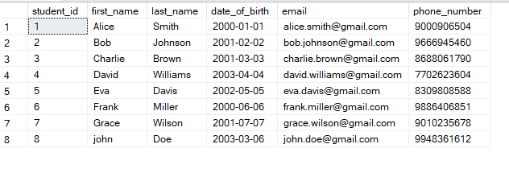
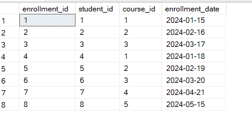

```sql
CREATE TABLE Students (
    student_id INT PRIMARY KEY,
    first_name VARCHAR(50),
    last_name VARCHAR(50),
    date_of_birth DATE,
    email VARCHAR(100),
    phone_number bigint
);


-- Insert data into Students Table
INSERT INTO Students (student_id, first_name, last_name, date_of_birth, email, phone_number) VALUES
(1, 'Alice', 'Smith', '2000-01-01', 'alice.smith@gmail.com', 9000906504),
(2, 'Bob', 'Johnson', '2001-02-02', 'bob.johnson@gmail.com', 9666945460),
(3, 'Charlie', 'Brown', '2001-03-03', 'charlie.brown@gmail.com', 8688061790),
(4, 'David', 'Williams', '2003-04-04', 'david.williams@gmail.com', 7702623604),
(5, 'Eva', 'Davis', '2002-05-05', 'eva.davis@gmail.com', 8309808588),
(6, 'Frank', 'Miller', '2000-06-06', 'frank.miller@gmail.com', 9886406851),
(7, 'Grace', 'Wilson', '2001-07-07', 'grace.wilson@gmail.com', 9010235678);


--1. Write an SQL query to insert a new student named John Doe into the "Students" table.
insert into Students(student_id, first_name, last_name, date_of_birth, email, phone_number) values
(8,'john','Doe','2003-03-06','john.doe@gmail.com',9948361612);
```



```sql
-- Create Courses Table
CREATE TABLE Courses (
    course_id INT PRIMARY KEY,
    course_name VARCHAR(100),
    credits INT,
    teacher_id INT
);

INSERT INTO Courses (course_id, course_name, credits, teacher_id) VALUES
(1, 'Math 101', 3, 1),
(2, 'History 201', 4, 2),
(3, 'Science 301', 3, 3),
(4, 'Art 101', 2, 1),
(5, 'Music 101', 3, 2);
 

 
-- Create Enrollments Table
CREATE TABLE Enrollments (
    enrollment_id INT PRIMARY KEY,
    student_id INT,
    course_id INT,
    enrollment_date DATE,
    FOREIGN KEY (student_id) REFERENCES Students(student_id),
    FOREIGN KEY (course_id) REFERENCES Courses(course_id)
);

INSERT INTO Enrollments (enrollment_id, student_id, course_id, enrollment_date) VALUES
(1, 1, 1, '2024-01-15'),
(2, 2, 2, '2024-02-16'),
(3, 3, 3, '2024-03-17'),
(4, 4, 1, '2024-01-18'),
(5, 5, 2, '2024-02-19'),
(6, 6, 3, '2024-03-20'),
(7, 7, 4, '2024-04-21');

-- 2. Write an SQL query to enroll an existing student in a course, specifying the enrollment date.

INSERT INTO Enrollments (enrollment_id, student_id, course_id, enrollment_date) VALUES(8,8,5,'2024-05-15');



-- Create Teachers Table
CREATE TABLE Teachers (
    teacher_id INT PRIMARY KEY,
    first_name VARCHAR(50),
    last_name VARCHAR(50),
    email VARCHAR(100)
);

-- Insert data into Teachers Table
INSERT INTO Teachers (teacher_id, first_name, last_name, email) VALUES
(1, 'Johnny', 'lever', 'johnny.lever@gmail.com'),
(2, 'Jane', 'Austen', 'jane.austen@gmail.com'),
(3, 'Mark', 'Twain', 'mark.twain@gmail.com');  


--3. Update the email address of a teacher in the "Teachers" table.


update Teachers set email='johnnylever01@gmail.com' where teacher_id=1;


-- Create Payments Table
CREATE TABLE Payments (
    payment_id INT PRIMARY KEY,
    student_id INT,
    amount DECIMAL(10, 2),
    payment_date DATE,
    FOREIGN KEY (student_id) REFERENCES Students(student_id)
);
   

 -- Insert data into Payments Table
INSERT INTO Payments (payment_id, student_id, amount, payment_date) VALUES
(1, 1, 500.00, '2024-05-10'),
(2, 2, 700.00, '2024-05-11'),
(3, 3, 300.00, '2024-05-12'),
(4, 4, 400.00, '2024-05-13'),
(5, 5, 600.00, '2024-05-14'),
(6, 6, 350.00, '2024-05-15'),
(7, 7, 450.00, '2024-05-16');  


